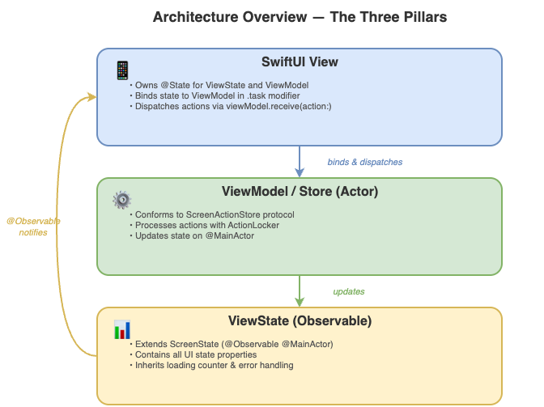
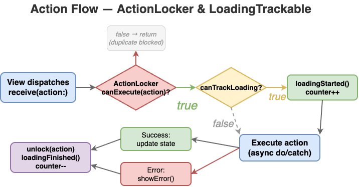
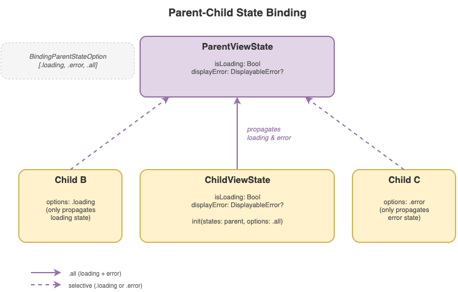

# ScreenStateKit

[](https://swift.org)
[](https://developer.apple.com/ios/)
[](https://developer.apple.com/macos/)
[](https://github.com/anthony1810/ScreenStateKit/actions/workflows/tests.yml)
[](https://github.com/anthony1810/ScreenStateKit/tree/main/Tests)

A comprehensive, fully tested Swift state management and UI toolkit for iOS 17+ applications built with SwiftUI. This framework provides reactive state containers, async action handling, task lifecycle management, and pre-built UI components for common patterns like loading states, error handling, and pagination.

**Main Contributor:** [@ThangKM](https://github.com/ThangKM)

## Sample Project

Check out the [Definery](https://github.com/anthony1810/Definery) app for a real-world example of ScreenStateKit in action.

## Table of Contents

- [Requirements](#requirements)
- [Installation](#installation)
- [Architecture Overview](#architecture-overview)
- [Complete Feature Example](#complete-feature-example)
- [StateUpdatable](#stateupdatable)
- [Parent State Binding](#parent-state-binding)
- [View Modifiers](#view-modifiers)
- [Skeleton Loading (Placeholder)](#skeleton-loading-placeholder)
- [Load More Pagination](#load-more-pagination)
- [Environment CRUD Callbacks](#environment-crud-callbacks)
- [AsyncAction](#asyncaction)
- [Async Streaming](#async-streaming)
- [API Reference](#api-reference)
- [License](#license)

---

## Requirements

- iOS 17.0+ / macOS 14.0+
- Swift 5.9+
- Xcode 15.0+

## Installation

### Swift Package Manager

Add the following to your `Package.swift`:

```swift
dependencies: [
    .package(url: "https://github.com/anthony1810/ScreenStateKit.git", from: "1.0.0")
]
```

Or in Xcode: **File > Add Package Dependencies** and enter:

```
https://github.com/anthony1810/ScreenStateKit.git
```

---

## Architecture Overview

ScreenStateKit promotes a clean architecture pattern for building features with three core components:

<p align="center">
  
</p>

### The Three Pillars

1. **State** (`ScreenState` subclass) - Observable state container that holds all UI-related data
2. **Action Dispatcher** (`ScreenActionStore` conforming actor) - ViewModel or Store that processes actions
3. **View** - SwiftUI view that binds state to dispatcher and triggers actions

---

## Complete Feature Example

Here's a complete example showing how to build a feature using ScreenStateKit's architecture:

### 1. Define the State

```swift
import Foundation
import ScreenStateKit
import Observation

@Observable @MainActor
final class FeatureViewState: LoadmoreScreenState, StateUpdatable {
    // UI Configuration
    let headerHeight: CGFloat = 120.0

    // Data State
    var items: [Item] = []
}
```

### 2. Define the ViewModel/Store

```swift
import Foundation
import ScreenStateKit

actor FeatureViewStore: ScreenActionStore {
    // MARK: - Dependencies
    private let dataService: DataServiceProtocol

    // MARK: - State Management
    private let actionLocker = ActionLocker()
    weak var viewState: FeatureViewState?

    // MARK: - Init
    init(dataService: DataServiceProtocol) {
        self.dataService = dataService
    }

    // MARK: - Actions
    enum Action: ActionLockable, LoadingTrackable, Sendable {
        case fetchItems
        case loadMore

        var canTrackLoading: Bool {
            switch self {
            case .fetchItems:
                return true
            case .loadMore:
                return false
            }
        }
    }

    // MARK: - ScreenActionStore Protocol
    func binding(state: FeatureViewState) {
        self.viewState = state
    }

    nonisolated func receive(action: Action) {
        Task {
            await isolatedReceive(action: action)
        }
    }

    // MARK: - Action Processing
    func isolatedReceive(action: Action) async {
        guard await actionLocker.canExecute(action) else { return }
        await viewState?.loadingStarted(action: action)

        do {
            switch action {
            case .fetchItems:
                try await fetchItems()
            case .loadMore:
                try await loadMoreItems()
            }
        } catch {
            await viewState?.showError(
                DisplayableError(message: error.localizedDescription)
            )
        }

        await actionLocker.unlock(action)
        await viewState?.loadingFinished(action: action)
    }

    // MARK: - Action Implementations
    private func fetchItems() async throws {
        let result = try await dataService.fetchItems(page: 1, limit: 20)
        await viewState?.updateState { state in
            state.items = result.items
        }
    }

    private func loadMoreItems() async throws {
        let currentItems = await viewState?.items ?? []
        let result = try await dataService.fetchItems(page: 2, limit: 20)
        await viewState?.updateState { state in
            state.items = currentItems + result.items
        }
    }
}
```

**Action Flow:** Here's how actions are processed through `ActionLocker` and `LoadingTrackable`:

<p align="center">
  
</p>

### 3. Build the View

```swift
import SwiftUI
import ScreenStateKit

struct FeatureView: View {
    // MARK: - State
    @State private var viewState: FeatureViewState
    @State private var viewStore: FeatureViewStore

    // MARK: - Init
    init(viewState: FeatureViewState, viewStore: FeatureViewStore) {
        self.viewState = viewState
        self.viewStore = viewStore
    }

    // MARK: - Body
    var body: some View {
        ZStack {
            Color(.systemBackground)
                .ignoresSafeArea()

            contentBody()
        }
        .onShowLoading($viewState.isLoading)
        .onShowError($viewState.displayError)
        .task {
            // Critical: Bind state to viewStore
            await viewStore.binding(state: viewState)

            // Initial data fetch
            viewStore.receive(action: .fetchItems)
        }
    }

    // MARK: - Content
    @ViewBuilder
    private func contentBody() -> some View {
        if viewState.items.isEmpty && !viewState.isLoading {
            emptyStateView()
        } else {
            itemListView()
        }
    }

    private func itemListView() -> some View {
        List {
            ForEach(viewState.items) { item in
                ItemRow(item: item)
            }

            // Load more indicator
            if !viewState.items.isEmpty && viewState.canShowLoadmore {
                RMLoadmoreView(states: viewState)
            }
        }
        .refreshable {
            try? await viewStore.isolatedReceive(action: .fetchItems)
        }
    }

    private func emptyStateView() -> some View {
        VStack(spacing: 16) {
            Image(systemName: "tray")
                .font(.system(size: 48))
                .foregroundStyle(.secondary)

            Text("No Items")
                .font(.title2)

            Text("Pull down to refresh")
                .font(.subheadline)
                .foregroundStyle(.secondary)
        }
    }
}
```

---

## StateUpdatable

The `StateUpdatable` protocol provides a safe way to batch state updates with optional animation and transaction control.

```swift
@MainActor
public protocol StateUpdatable {
    func updateState(
        _ updateBlock: @MainActor (_ state: Self) -> Void,
        withAnimation animation: Animation?,
        disablesAnimations: Bool
    )
}
```

Conform your state class to `StateUpdatable` to gain the `updateState` method:

```swift
@Observable @MainActor
final class MyViewState: ScreenState, StateUpdatable {
    var items: [Item] = []
    var title: String = ""
}
```

### Usage

```swift
// Basic state update (no animation)
await viewState?.updateState { state in
    state.items = newItems
    state.title = "Updated"
}

// Update with animation
await viewState?.updateState({ state in
    state.items = newItems
}, withAnimation: .easeInOut)

// Update with animations disabled
await viewState?.updateState({ state in
    state.items = newItems
}, disablesAnimations: true)
```

---

## Parent State Binding

`ScreenState` supports parent-child relationships, where loading and error states propagate upward from a child state to a parent.

<p align="center">
  
</p>

```swift
public struct BindingParentStateOption: OptionSet, Sendable {
    public static let loading  // Propagate loading state
    public static let error    // Propagate error state
    public static let all      // Propagate both (default)
}
```

### Usage

```swift
@Observable @MainActor
final class ParentViewState: ScreenState { }

@Observable @MainActor
final class ChildViewState: ScreenState {
    init(parent: ParentViewState) {
        // Propagate both loading and error to parent
        super.init(states: parent)
    }
}

// Or selectively propagate only loading:
final class ChildViewState: ScreenState {
    init(parent: ParentViewState) {
        super.init(states: parent, options: .loading)
    }
}
```

When the child's `isLoading` changes or `displayError` is set, the parent state is automatically updated.

---

## View Modifiers

### .onShowError

Automatically displays error alerts when error state changes.

```swift
.onShowError($viewState.displayError)
```

### .onShowLoading

Shows centered circular progress indicator with opacity animation.

```swift
.onShowLoading($viewState.isLoading)
```

### .onShowBlockLoading

Shows full-screen semi-transparent loading overlay that blocks interaction.

```swift
.onShowBlockLoading($viewState.isLoading, subtitles: "Saving...")
```

---

## Skeleton Loading (Placeholder)

ScreenStateKit provides a `PlaceholderRepresentable` protocol and `.placeholder()` view modifier for skeleton loading effects using SwiftUI's built-in `.redacted(reason: .placeholder)`.

### 1. Conform Your Data to PlaceholderRepresentable

```swift
struct HomeSnapshot: Equatable, PlaceholderRepresentable {
    let items: [Item]

    static var placeholder: HomeSnapshot {
        HomeSnapshot(items: Item.mocks)
    }

    var isPlaceholder: Bool { self == .placeholder }
}
```

### 2. Use .placeholder() in Your View

The `.placeholder()` modifier applies `.redacted(reason: .placeholder)` automatically when the value is a placeholder instance:

```swift
ForEach(viewState.snapshot.items) { item in
    ItemCardView(item: item)
}
.placeholder(viewState.snapshot)
```

Pair it with a shimmer library for a polished skeleton loading effect:

```swift
ForEach(viewState.snapshot.items) { item in
    ItemCardView(item: item)
}
.placeholder(viewState.snapshot)
.shimmering(active: viewState.snapshot.isPlaceholder)
```

### 3. Initialize State with Placeholder

```swift
@Observable @MainActor
final class HomeViewState: ScreenState, StateUpdatable {
    var snapshot: HomeSnapshot = .placeholder  // Start with skeleton
}
```

Once real data loads, update the snapshot and the redaction is automatically removed.

---

## Load More Pagination

### LoadmoreScreenState

Extend `LoadmoreScreenState` instead of `ScreenState` to get built-in pagination support:

```swift
@Observable @MainActor
final class ListViewState: LoadmoreScreenState, StateUpdatable {
    var items: [Item] = []
}
```

**Properties:**
- `canShowLoadmore: Bool` (read-only) - Whether the load more indicator should be visible
- `didLoadAllData: Bool` (read-only) - Whether all data has been loaded

**Methods:**
- `canExecuteLoadmore()` - Enables the load more indicator (no-op if `didLoadAllData` is true)
- `updateDidLoadAllData(_ didLoadAllData: Bool)` - Updates the `didLoadAllData` flag and toggles `canShowLoadmore`
- `ternimateLoadmoreView()` - Hides the load more indicator

### RMLoadmoreView

A pre-built `ProgressView` that automatically calls `canExecuteLoadmore()` when it disappears (scrolled past):

```swift
List {
    ForEach(viewState.items) { item in
        ItemRow(item: item)
    }

    if viewState.canShowLoadmore {
        RMLoadmoreView(states: viewState)
    }
}
```

---

## Environment CRUD Callbacks

Environment-based action callbacks for passing actions down the view hierarchy. Perfect for CRUD operations where child views need to notify parents of changes.

**Available Modifiers:**
| Modifier | Description |
|----------|-------------|
| `.onEdited(_ action:)` | Set edited callback |
| `.onDeleted(_ action:)` | Set deleted callback |
| `.onCreated(_ action:)` | Set created callback |
| `.onCancelled(_ action:)` | Set cancelled callback |

### Parent Setting Callbacks

```swift
struct ItemListView: View {
    @State private var viewState = ItemListViewState()
    @State private var viewModel: ItemListViewModel
    @State private var showCreateSheet = false
    @State private var selectedItem: Item?

    var body: some View {
        List(viewState.items) { item in
            ItemRow(item: item)
                .onTapGesture { selectedItem = item }
        }
        .sheet(isPresented: $showCreateSheet) {
            CreateItemView()
        }
        .sheet(item: $selectedItem) { item in
            EditItemView(item: item)
        }
        // Parent sets callbacks for child views to trigger
        .onCreated { [weak viewModel] in
            viewModel?.receive(action: .refreshItems)
        }
        .onEdited { [weak viewModel] in
            viewModel?.receive(action: .refreshItems)
        }
        .onDeleted { [weak viewModel] in
            viewModel?.receive(action: .refreshItems)
        }
    }
}
```

### Child Consuming Callbacks

```swift
struct EditItemView: View {
    @Environment(\.dismiss) private var dismiss
    @Environment(\.onEditedAction) private var onEditedAction
    @Environment(\.onDeletedAction) private var onDeletedAction
    @Environment(\.onCancelledAction) private var onCancelledAction

    let item: Item
    @State private var editedName: String
    @State private var showDeleteConfirmation = false

    var body: some View {
        NavigationStack {
            Form {
                TextField("Item Name", text: $editedName)

                Button("Delete Item", role: .destructive) {
                    showDeleteConfirmation = true
                }
            }
            .toolbar {
                ToolbarItem(placement: .cancellationAction) {
                    Button("Cancel") {
                        onCancelledAction?.execute()
                        dismiss()
                    }
                }
                ToolbarItem(placement: .confirmationAction) {
                    Button("Save") {
                        Task {
                            await updateItem()
                            await onEditedAction?.asyncExecute()
                            dismiss()
                        }
                    }
                }
            }
            .alert("Delete Item?", isPresented: $showDeleteConfirmation) {
                Button("Delete", role: .destructive) {
                    Task {
                        await deleteItem()
                        await onDeletedAction?.asyncExecute()
                        dismiss()
                    }
                }
                Button("Cancel", role: .cancel) {}
            }
        }
    }
}
```

---

## AsyncAction

A generic wrapper for async/await operations with configurable input and output types.

**Type Aliases:**
| Alias | Definition | Use Case |
|-------|------------|----------|
| `AsyncActionVoid` | `AsyncAction<Void, Void>` | No input, no output |
| `AsyncActionGet<Output>` | `AsyncAction<Void, Output>` | No input, returns output |
| `AsyncActionPut<Input>` | `AsyncAction<Input, Void>` | Takes input, no output |

### Examples

```swift
// Fire and forget action
let refreshAction: AsyncActionVoid = .init {
    await dataStore.refresh()
}
refreshAction.execute()

// Action that returns data
let getSettings: AsyncActionGet<Settings> = .init {
    return await settingsManager.currentSettings
}
let settings = try await getSettings.asyncExecute()

// Action that takes input but returns nothing
let saveItem: AsyncActionPut<Item> = .init { item in
    await itemStore.save(item)
}
saveItem.execute(myItem)

// Full input/output action
let fetchUser: AsyncAction<String, User> = .init { userId in
    return try await userService.fetchUser(id: userId)
}
let user = try await fetchUser.asyncExecute("user-123")
```

---

## Async Streaming

### StreamProducer

A multi-consumer async event emitter (actor-based) that allows multiple subscribers to receive events. Conforms to the `StreamProducerType` protocol.

```swift
// Create a stream producer
let eventProducer = StreamProducer<UserEvent>()

// Emit events from anywhere
await eventProducer.emit(element: .userLoggedIn(user))
await eventProducer.emit(element: .profileUpdated(profile))

// Subscribe to events
Task {
    for await event in await eventProducer.stream {
        switch event {
        case .userLoggedIn(let user):
            print("User logged in: \(user.name)")
        case .profileUpdated(let profile):
            print("Profile updated")
        }
    }
}

// Finish the stream when done
await eventProducer.finish()
```

**Options:**
- `withLatest: Bool` (default `true`) - When `true`, new subscribers immediately receive the most recently emitted element.

```swift
// New subscribers get the latest element immediately
let producer = StreamProducer<Int>(element: 0, withLatest: true)

// New subscribers only get future elements
let producer = StreamProducer<Int>(withLatest: false)
```

**Non-isolated methods** for use from `nonisolated` or `deinit` contexts:
- `nonIsolatedEmit(_ element:)` - Emits from a non-isolated context
- `nonIsolatedFinish()` - Finishes the stream from a non-isolated context

### CancelBag

Manages and cancels multiple async tasks. Essential for cleanup in actors and view models.

```swift
actor MyViewModel {
    private let cancelBag = CancelBag()
    private let eventProducer = StreamProducer<DataEvent>()

    deinit {
        cancelBag.cancelAllInTask()
    }

    func startObserving() {
        // Store task with identifier for later cancellation
        Task.detached { [weak self] in
            guard let stream = await self?.eventProducer.stream else { return }
            for await event in stream {
                await self?.handleEvent(event)
            }
        }.store(in: cancelBag, withIdentifier: "eventObserver")
    }

    func stopObserving() async {
        await cancelBag.cancel(forIdentifier: "eventObserver")
    }
}
```

**Methods:**
- `cancelAll()` - Cancels all stored tasks
- `cancel(forIdentifier:)` - Cancels a specific task by its identifier
- `cancelAllInTask()` - Non-isolated version for use in `deinit`

**Task extension:**
- `task.store(in: cancelBag)` - Store with auto-generated identifier
- `task.store(in: cancelBag, withIdentifier: "id")` - Store with a specific identifier (cancels any existing task with the same identifier)

### AnyAsyncStream

Type-erased wrapper for any `AsyncSequence`, useful for abstracting different stream types.

```swift
// Wrap any async sequence
let wrappedStream = someAsyncSequence.anyAsyncStream

// Use in generic contexts
func observe<T>(stream: AnyAsyncStream<T>) async {
    while let value = try? await stream.next() {
        process(value)
    }
}
```

---

## API Reference

### Protocols

| Protocol | Purpose |
|----------|---------|
| `ScreenActionStore` | Actor-based protocol for ViewModels. Requires `binding(state:)` and `receive(action:)` |
| `ActionLockable` | Provides a `lockKey` for action deduplication. Auto-conforms for `Hashable` types |
| `LoadingTrackable` | Declares whether an action should track loading state via `canTrackLoading` |
| `StateUpdatable` | Provides `updateState(_:withAnimation:disablesAnimations:)` for batched state updates |
| `PlaceholderRepresentable` | Declares `placeholder` and `isPlaceholder` for skeleton loading |
| `StreamProducerType` | Actor protocol for multi-subscriber async stream producers |
| `TypeNamed` | Provides `declaredName` and `typeNamed` for type name reflection |

### Classes

| Class | Purpose |
|-------|---------|
| `ScreenState` | `@Observable @MainActor` base class with loading counter, error handling, and parent binding |
| `LoadmoreScreenState` | Extends `ScreenState` with pagination state (`canShowLoadmore`, `didLoadAllData`) |

### Actors

| Actor | Purpose |
|-------|---------|
| `ActionLocker` | Prevents duplicate action execution with `lock`, `unlock`, `canExecute`, `free` |
| `CancelBag` | Task lifecycle management with identifier-based cancellation |
| `StreamProducer<Element>` | Multi-subscriber async stream with optional latest-value replay |

### Structs

| Struct | Purpose |
|--------|---------|
| `AsyncAction<Input, Output>` | Generic async action wrapper with `execute` and `asyncExecute` |
| `DisplayableError` | `LocalizedError` wrapper for displaying error alerts |
| `AnyAsyncStream<Element>` | Type-erased `AsyncSequence` wrapper |
| `RMLoadmoreView` | Pre-built `ProgressView` for load-more pagination |

### View Modifiers

| Modifier | Purpose |
|----------|---------|
| `.onShowError(_:)` | Displays error alert from `DisplayableError?` binding |
| `.onShowLoading(_:)` | Shows centered progress indicator |
| `.onShowBlockLoading(_:subtitles:)` | Shows full-screen blocking loading overlay |
| `.placeholder(_:)` | Applies `.redacted(reason: .placeholder)` for skeleton loading |
| `.onEdited(_:)` | Environment callback for edit actions |
| `.onDeleted(_:)` | Environment callback for delete actions |
| `.onCreated(_:)` | Environment callback for create actions |
| `.onCancelled(_:)` | Environment callback for cancel actions |

---

## License

MIT License

---

## Acknowledgments

Built with Swift's modern concurrency features including `async/await`, actors, and the `@Observable` macro.
